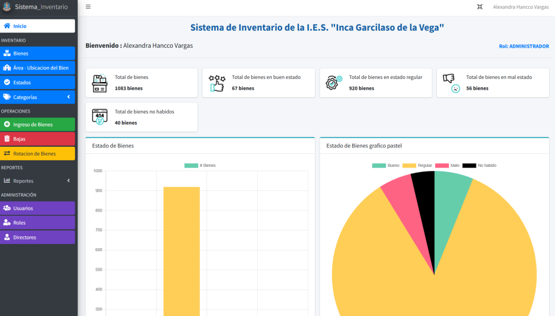
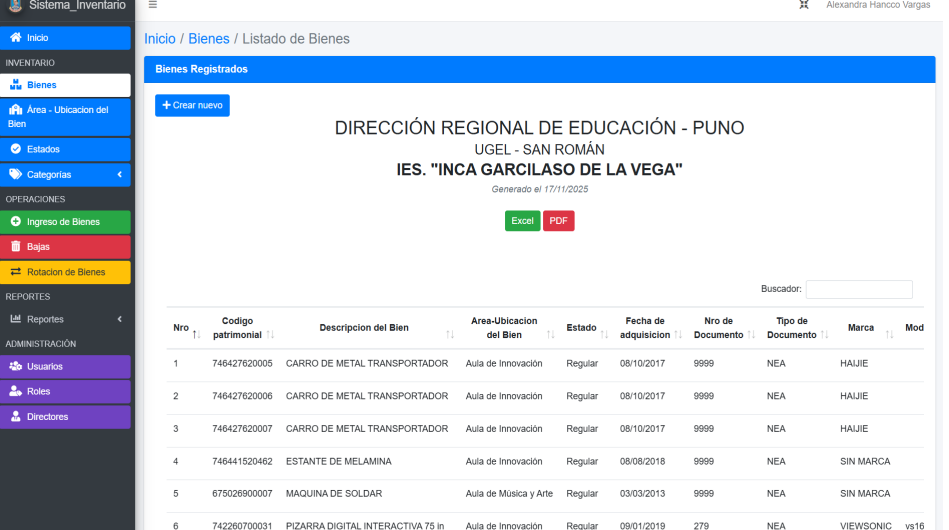
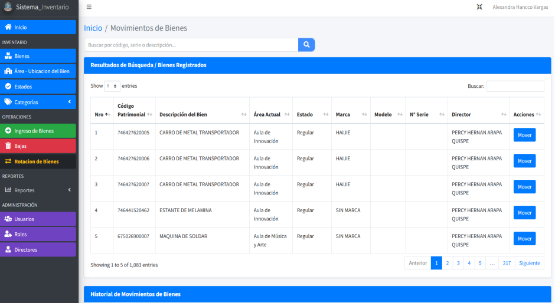

# Sistema de Inventario Institucional – IES Inca Garcilaso de la Vega

Sistema web desarrollado con Laravel y MySQL para la gestión y control de bienes institucionales.

---

## Descripción

Aplicación desarrollada bajo el patrón MVC utilizando Laravel.  
Permite administrar bienes, categorías, áreas, estados, movimientos y bajas dentro del sistema institucional.

Incluye sistema de autenticación y control de permisos.

---

## Tecnologías Utilizadas

- PHP
- Laravel
- MySQL
- Blade
- Vite
- Composer
- Git & GitHub

---

## Funcionalidades

- Gestión completa de bienes (CRUD)
- Administración de categorías
- Gestión de áreas
- Registro de directores
- Control de estados
- Registro de movimientos
- Gestión de bajas
- Sistema de usuarios y permisos

---

## Base de Datos

Base de datos relacional en MySQL gestionada mediante migraciones de Laravel.

Tablas principales:

- users
- directors
- areas
- estados
- bienes
- categorias
- movimientos
- bajas
- permission_tables

---

## Arquitectura

El sistema sigue el patrón Modelo – Vista – Controlador (MVC) utilizando la estructura estándar de Laravel.

---

##  Capturas del Sistema
###  Login

###  Panel Principal

###  Gestión de Bienes

###  Movimientos

---

## Instalación

1. Clonar el repositorio
2. Ejecutar:
3. Configurar archivo `.env`
4. Ejecutar:

---

## Desarrollado por

Alexandra Adela Hancco Vargas  
Ingeniería de Software con Inteligencia Artificial– SENATI

